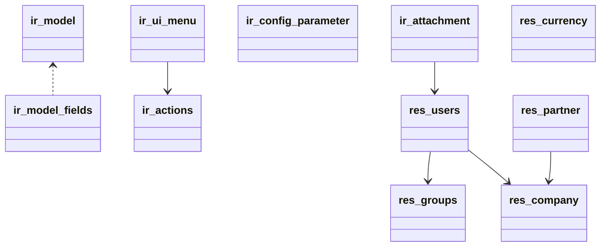

# Base Addon Deep Dive

The `base` addon provides the foundation for all Odoo applications.

## Key Models
- `ir.model`, `ir.model.fields`: model metadata and fields registry.
- `ir.ui.menu`, `ir.actions.*`: client actions and menu hierarchy.
- `ir.config_parameter`: runtime configuration key/value store.
- `ir.attachment`: binary attachments with filestore storage.
- `res.users`, `res.groups`, `res.company`, `res.partner`, `res.currency`.

## Controllers
- Minimal endpoints for attachments and common actions.

## Security
- Group definitions and default access rights via `ir.model.access.csv`.
- Record rules for multi-company and user-specific data.

## Data
- Seed actions, menus, parameters, currencies, companies, languages.

## Notes
- Many application modules only extend these models via `_inherit`.
