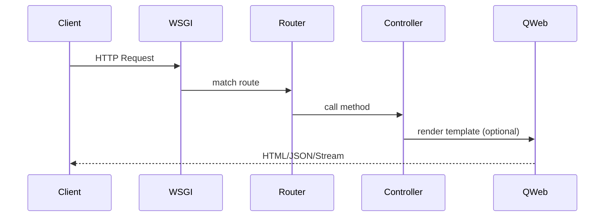

# HTTP Layer

Request handling and routing.

## Controllers
- Defined with `@http.route` in Python files.
- Support auth: `public`, `user`, `none`.
- Return types: HTML (QWeb), JSON, files.

## Request Lifecycle

## Sessions & Security
- CSRF tokens for forms.
- `request.env` and `request.uid` for user context.
- Access rules enforced by ORM.

## Base Addon
- Provides base controllers for menus, actions, attachments APIs.
