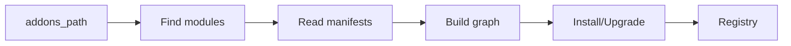

# Modules System

How addons are discovered, installed, and loaded.

## Addons Path Resolution
- `odoo.addons.__path__` and configured `addons_path` entries.
- Python 3.11 fix applied: cast namespace path to `list()` before concatenation.

## Manifests
- `__manifest__.py`: dependencies, data files, security, assets.
- Dependency graph used to order installation/updates.

## Loading Process

## Data Files
- XML/YAML/CSV loaded in manifest order.
- `noupdate="1"` for persistent records.

## Base Addon
- Seed system models/actions/menus.
- Provides categories, groups, security, and core views.
