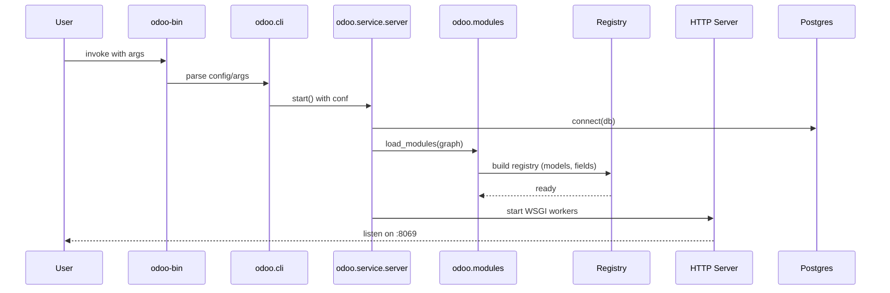
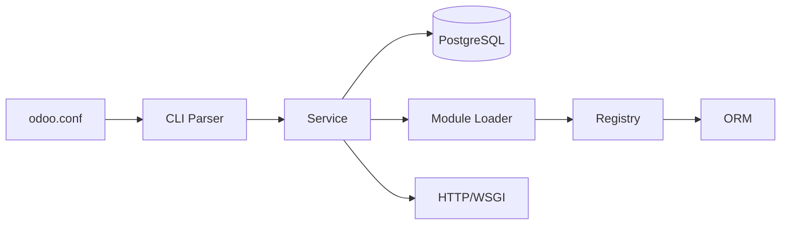

# Startup Flow

Phases
- Configuration: `odoo.conf`, CLI flags, env vars.
- Database: check, create (if init), connect.
- Modules graph: resolve dependencies, install/upgrade as needed.
- Registry build: import Python files, register models, fields, methods.
- HTTP server: start in single-process or multi-worker mode.
- Services: cron, longpolling bus, reports, i18n.

Workers Modes
- Single worker (dev): everything in one process (default here).
- Multi worker: master + workers via `--workers N`.

