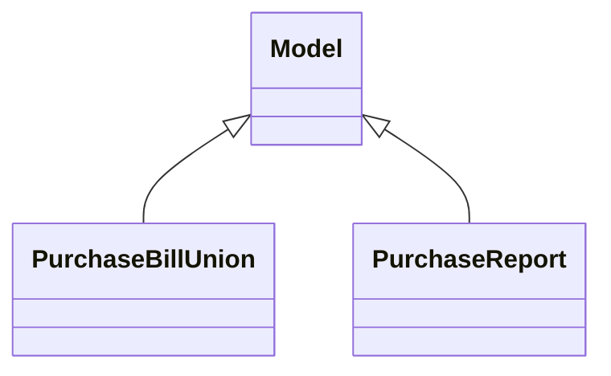

# Reports

Report definitions and templates in purchase.

## Available Reports

### PDF/Document Reports
- **Purchase Order** (PDF/Print)
- **Request for Quotation** (PDF/Print)

### Analytical/Dashboard Reports
- **Purchase Analysis** (Analysis/Dashboard)

## Report Files

- **__init__.py** (Python logic)
- **purchase_bill.py** (Python logic)
- **purchase_bill_views.xml** (XML template/definition)
- **purchase_order_templates.xml** (XML template/definition)
- **purchase_quotation_templates.xml** (XML template/definition)
- **purchase_report.py** (Python logic)
- **purchase_reports.xml** (XML template/definition)
- **purchase_report_views.xml** (XML template/definition)

## Notes
- Named reports above are accessible through Odoo's reporting menu
- Python files define report logic and data processing
- XML files contain report templates, definitions, and formatting
- Reports are integrated with Odoo's printing and email systems
