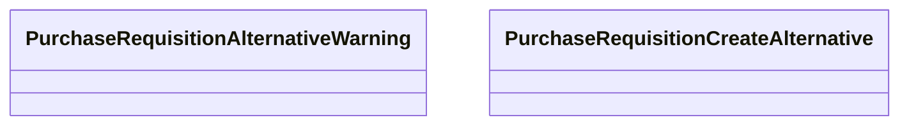

# Wizards

Transient models exposed as UI wizards in purchase_requisition.

```mermaid
classDiagram
    class PurchaseRequisitionAlternativeWarning
    class PurchaseRequisitionCreateAlternative
```
